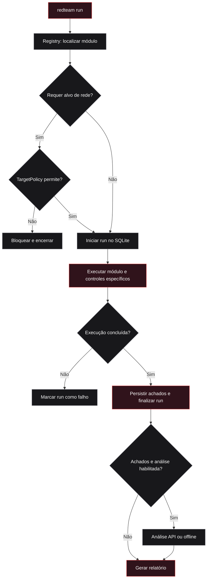
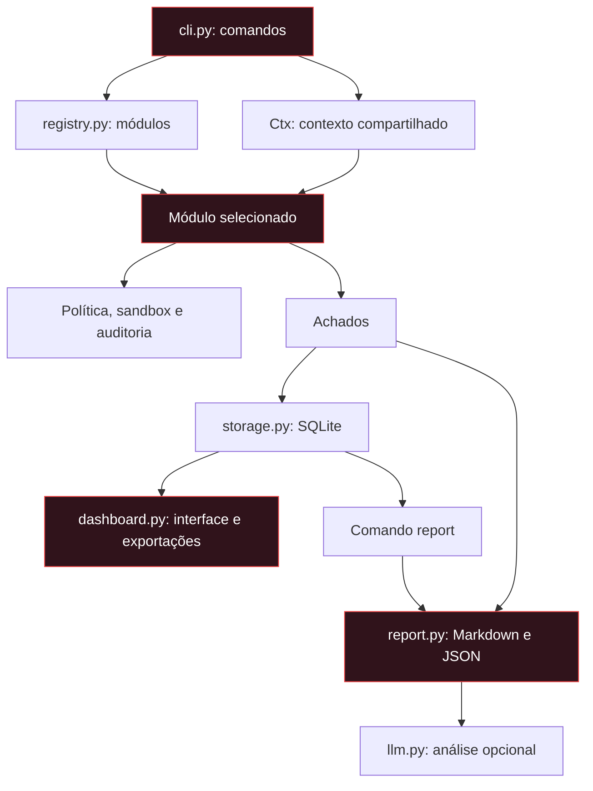

# redteam-cli

```
██████╗ ███████╗██████╗ ████████╗███████╗ █████╗ ███╗   ███╗
██╔══██╗██╔════╝██╔══██╗╚══██╔══╝██╔════╝██╔══██╗████╗ ████║
██████╔╝█████╗  ██║  ██║   ██║   █████╗  ███████║██╔████╔██║
██╔══██╗██╔══╝  ██║  ██║   ██║   ██╔══╝  ██╔══██║██║╚██╔╝██║
██║  ██║███████╗██████╔╝   ██║   ███████╗██║  ██║██║ ╚═╝ ██║
╚═╝  ╚═╝╚══════╝╚═════╝    ╚═╝   ╚══════╝╚═╝  ╚═╝╚═╝     ╚═╝

 ██████╗██╗     ██╗
██╔════╝██║     ██║
██║     ██║     ██║
██║     ██║     ██║
╚██████╗███████╗██║
 ╚═════╝╚══════╝╚═╝
```

Framework CLI de **red team para laboratório** — módulos de reconhecimento,
exploração de aplicação, força bruta, criptografia, simulação de ransomware e
modelagem de vetores físicos, com geração de relatório e análise por LLM.

Tudo roda contra um **alvo falso embutido** (docker compose) ou contra hosts que
você declara seus. O objetivo é treinar o ciclo completo: descobrir → explorar →
registrar → priorizar → remediar.

---

## ⚠️ Uso autorizado apenas

Este projeto existe para **ensino e prática em ambiente próprio**.

- O alvo padrão é um container local (`lab/`) que sobe em `127.0.0.1`.
- Fora do lab, a ferramenta só aceita hosts **declarados em `targets.txt`** ou
  confirmados com `--i-own-it`.
- Nunca aponte isto para sistema de terceiros. No Brasil, acesso não autorizado
  é crime (Lei 12.737/2012 — Lei Carolina Dieckmann); nos EUA, CFAA.

**O que este projeto não faz:** não traz exploits de RCE funcionais, payloads
prontos para CVEs, nem rotina de C2/exfiltração. Os módulos que "atacam"
fazem isso de forma **observável e reversível** (veja abaixo).

---


## Fluxo de execução



A política aceita a allowlist explícita e endereços loopback/RFC1918.
A CLI inclui o alvo na allowlist quando recebe `--i-own-it`; para carregar um
arquivo, use `--targets targets.txt`. Redes privadas não comprovam propriedade:
a autorização continua sendo responsabilidade do operador.

Módulos sem alvo de rede pulam essa validação na CLI. A simulação de ransomware
tem controles específicos de sandbox e confirmação; o diagrama não representa
uma garantia de isolamento do sistema operacional.

## Onde ficam os resultados?

| Saída | Conteúdo | Como consultar |
|---|---|---|
| `redteam.db` | Execuções e achados persistidos em SQLite | Dashboard ou comando `report` |
| `audit.jsonl` | Eventos registrados pelos controles e módulos | Inspeção local do JSONL |
| `relatorio-<modulo>-<id>.md` | Achados, severidade e análise opcional | Leitor Markdown; caminho personalizável com `--out` |
| `.json` | Achados e metadados estruturados | Gerado com `--json` |
| Dashboard local | Distribuição de severidades, runs e achados | `http://127.0.0.1:8765` |
| Exportações do dashboard | Achados para integração | `/api/findings.json` e `/api/export.csv` |

## Instalação

```bash
git clone https://github.com/Diogo-Damasceno/redteam-cli.git
cd redteam-cli
python3 -m venv .venv && source .venv/bin/activate
pip install -e .
redteam list
```

> Em Arch/Fedora (PEP 668) o `pip` do sistema é bloqueado — use sempre o venv
> acima, não `--break-system-packages`.

Dependências: só stdlib. `cryptography` é opcional (sem ela, o módulo de
ransomware usa um fallback didático com HMAC).

## Subindo o alvo de treino

```bash
cd lab && docker compose up -d
curl http://127.0.0.1:8080/health
```

O alvo é **intencionalmente vulnerável**: `/search` concatena SQL direto,
`/login` usa MD5 com senhas fracas e não tem rate limit.

## Uso

```bash
redteam list                                    # módulos disponíveis

# reconhecimento
redteam run recon --target 127.0.0.1 --opt ports=1-1024

# SQL injection (sondagem por comportamento, não destrutiva)
redteam run sqli --target "http://127.0.0.1:8080/search?q=Bem" --opt param=q

# credential stuffing contra o lab
redteam run stuffing --target http://127.0.0.1:8080 --opt users=admin,test

# auditoria cripto + cracking offline
redteam run crypto --target ./meus-dados --opt crack=true

# simulação de ransomware (CIFRAGEM REAL, só dentro do sandbox)
redteam run ransomware --sandbox /tmp/lab-box --opt i_understand=true
redteam run ransomware --sandbox /tmp/lab-box --opt decrypt=true

# vetores físicos + controles
redteam run physical

# dashboard local dos achados
redteam dashboard --port 8765     # http://127.0.0.1:8765
```

O dashboard lê o mesmo `redteam.db` e mostra: contagem por severidade, barra
de distribuição, execuções e a lista de achados. Também expõe
`/api/findings.json` e `/api/export.csv` para integrar com outras ferramentas.

Cada execução grava achados em `redteam.db`, ações em `audit.jsonl` e gera um
relatório `.md` (opcionalmente `.json` com `--json`).

## Análise por LLM

Pluggable — qualquer endpoint OpenAI-compatible (OpenAI, OpenRouter, Groq,
LM Studio, vLLM). Configure:

```bash
export REDTEAM_LLM_BASE_URL=https://openrouter.ai/api/v1
export REDTEAM_LLM_API_KEY=...
export REDTEAM_LLM_MODEL=deepseek/deepseek-r1
```

Sem configuração, ele cai para análise offline (heurística) e o run nunca
quebra. Segredos são removidos do prompt antes do envio (`redact()`).

## Módulos

| Módulo | Categoria | O que faz | MITRE |
|---|---|---|---|
| `recon` | recon | varredura TCP concorrente, banner grabbing, TLS | T1595, T1046 |
| `sqli` | web | sondagem por erro/comportamento (sem DELETE/DROP) | T1190 |
| `stuffing` | credential | força bruta usuário×wordlist, sem evasão | T1110.004 |
| `crypto` | crypto | acha segredos/hashes fracos, cracking offline | T1110, T1552.001 |
| `ransomware` | ransomware | cifragem **real** confinada ao sandbox + decrypt | T1486, T1490 |
| `physical` | physical | vetores físicos (badUSB, evil maid, RFID) + defesas | T1200, T1098 |

## Arquitetura



<details>
<summary>Mapa dos arquivos-fonte</summary>

```
src/redteam/
├── cli.py              # argparse: list / run / report / dashboard
├── core/
│   ├── guardrails.py   # política de alvo, sandbox, auditoria  ← a linha ética
│   ├── registry.py     # descoberta de módulos
│   ├── storage.py      # SQLite (runs + findings)
│   ├── context.py      # Ctx compartilhado
│   ├── report.py       # markdown/json + análise LLM
│   ├── llm.py          # adapters (OpenAI-compatible / offline)
│   └── mitre.py        # mapa ATT&CK
└── modules/            # recon, sqli, stuffing, crypto, ransomware, physical
```

</details>

A CLI chama `ctx.check_target()` para módulos com `requires_target=True`.
A política de alvo fica centralizada em `guardrails.py`.

## Testes

```bash
python3 -m pytest tests/ -q
```

## Licença

MIT — veja [LICENSE](LICENSE).
